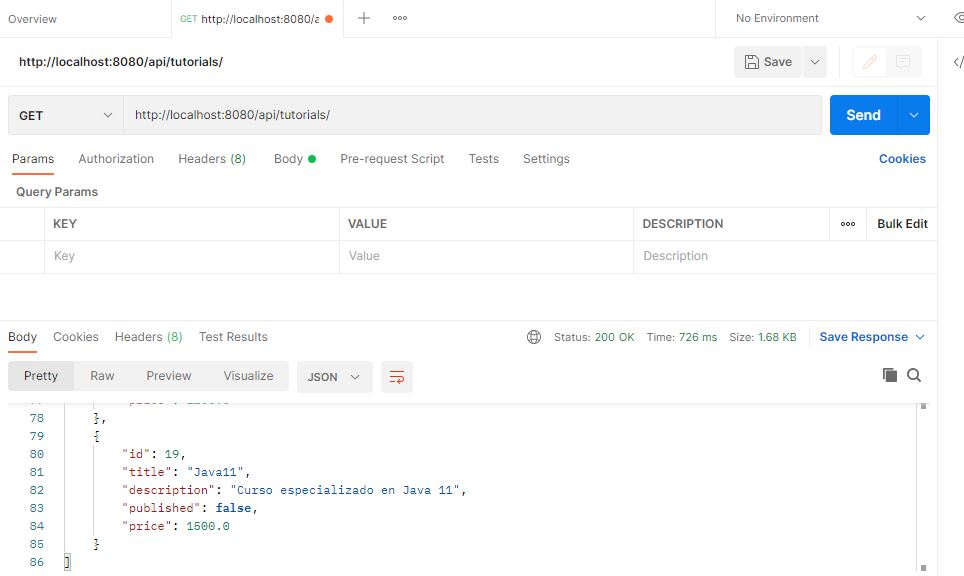
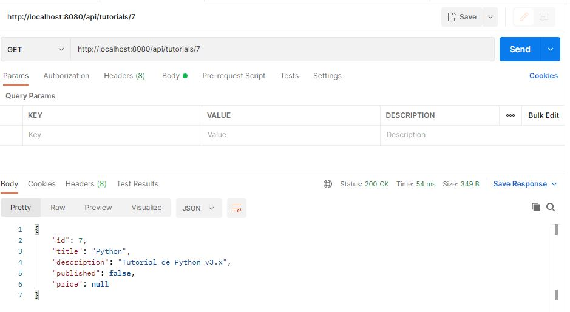
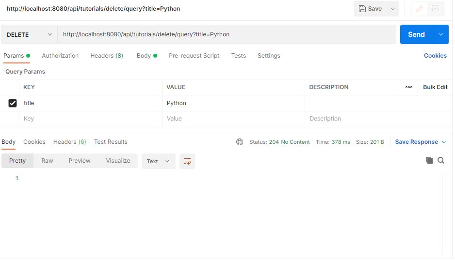
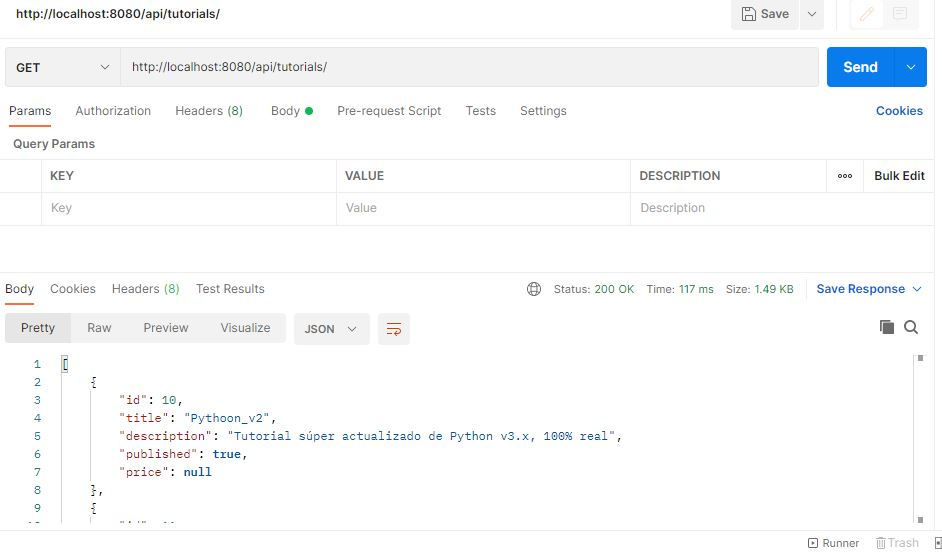
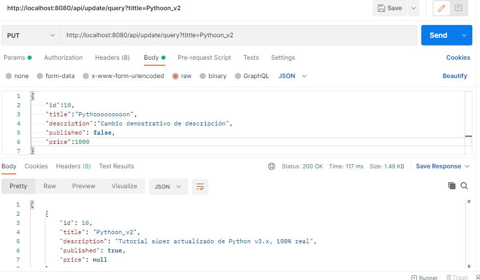
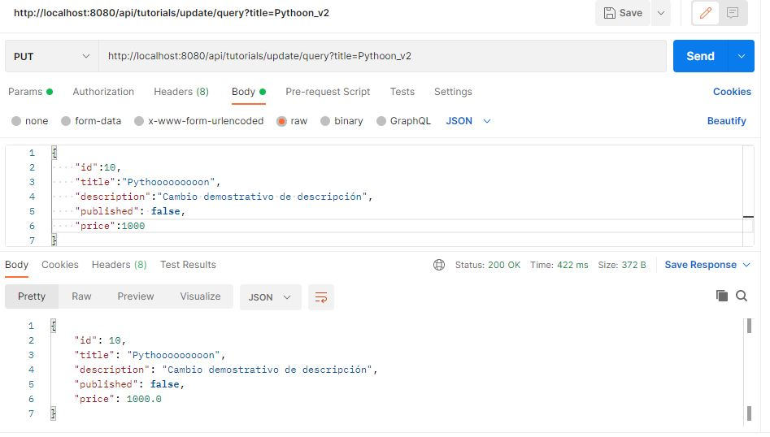
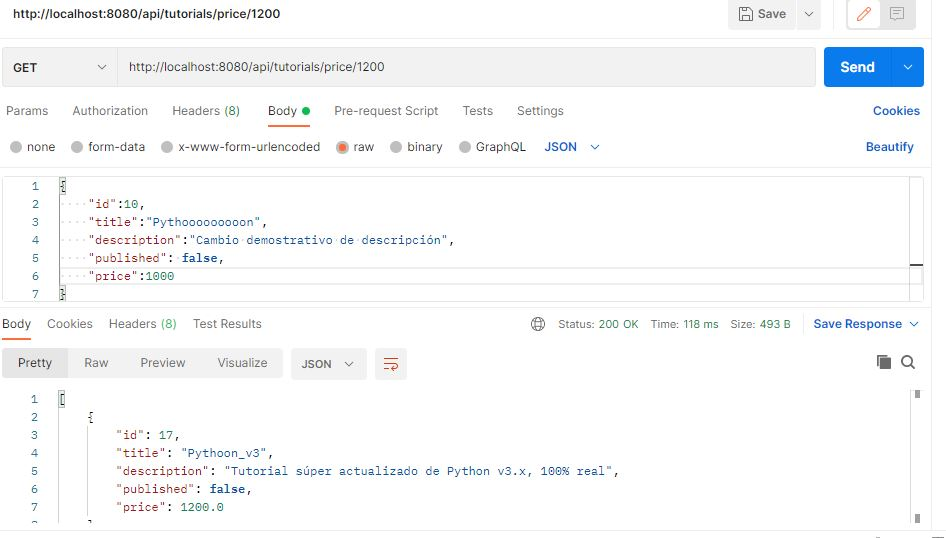

# Spring Boot JPA MySQL - Building Rest CRUD API example
"# API-rest-FULL-Tutorials" 

Testing that the server is ok and contains Tutorials. 

Getting a specific Tutorial by Id

Deleting all Tutorials by title Python

Testing No More Tutorial with title Python

Before changing tutorial Pythoon_v2 by title

After changing tutorial Pythoon_v2 by title

Getting tutorials by Price

